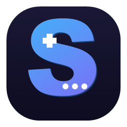

<p align="center">
  
</p>

<h1 align="center">Shin Translator</h1>

<p align="center">
  <b>An all-in-one, real-time visual novel translator for Windows.</b><br>
  Hook the game text or read it from the screen with OCR, and see the translation
  in a clean overlay — with Japanese learning tools built in.
</p>

<p align="center">
  <i>Portable. No installation. Works offline for text extraction and OCR.</i>
</p>

---

## ✨ Features

- **Automatic text hooking** — attach to a running visual novel and the dialogue is
  detected and translated automatically. Two hooking engines are bundled:
  - **Textractor** engine (default)
  - **LunaHook** engine (alternative — reads many games Textractor can't). One click to switch.
- **Smart Auto-Detect** — automatically picks the real dialogue text source and
  ignores junk threads (font tables, control codes, duplicate speaker names).
- **Floating overlay** — a movable, resizable translation window that sits on top of
  the game, with adjustable transparency, outline text for readability, and a
  minimize / show toggle.
- **Screen OCR (opsi A)** — for games that can't be hooked (e.g. RPG menus):
  - Select an area on screen, capture it, and it is OCR'd and translated instantly.
  - Each capture is saved as an image + text per game in an **OCR History** side panel,
    so you can reopen any past capture and its translation.
  - Powered by the offline Windows OCR engine (install the Japanese language pack for best results).
- **Game profiles** — save a game's engine + language so it is ready instantly next
  time. **Import / Export** profiles to share them with others.
- **Japanese learning tools** — show the original text with furigana, space words for
  readability, and click any word/kanji for an offline dictionary lookup (kanji info + JLPT vocab).
- **Many target languages** — translate into English, Indonesian, and dozens more.
- **Fully portable** — everything (profiles, OCR history, settings) is stored next to
  the app. Move the folder and your data goes with it.

---

## 🚀 Getting started

1. Download the latest release and **extract the whole folder** anywhere.
2. Run **`Shin Translator.exe`**.
3. Click **Choose a game** and pick the running visual novel / game window.
4. Text is detected and translated automatically. The floating overlay shows the
   translation on top of the game.
5. If a game's text does not appear, click **Switch to LunaHook** to try the
   alternative engine.

### Screen OCR (for games that can't be hooked)

1. In the **Screen OCR** card, click **Select area**.
2. The main window hides; drag a box over the text you want, then click **Capture**
   (or **Cancel** to abort).
3. The area is captured, OCR'd, and translated. Open the **OCR History** panel on the
   right to browse, reopen, or delete past captures — grouped per game.

### Tips

- First launch may trigger Windows SmartScreen ("Windows protected your PC"): click
  **More info → Run anyway**. This is normal for unsigned apps.
- Some Japanese games need Japanese system locale, or use the built-in
  Japanese-locale launch option.
- For OCR, install the **Japanese language pack** in Windows Settings → Time & Language.

---

## 🏗️ Building from source

Shin Translator is a C++/Qt5 application. It builds with MSVC (Visual Studio 2022) and
CMake, for both x86 and x64 (both are needed — the architecture must match the game).

```
# x64 (developer command prompt: vcvars64.bat)
cmake --build build_x64

# x86 (developer command prompt: vcvars32.bat)
cmake --build build_x86
```

Requirements: Qt 5.15.x (MSVC), CMake, and the Visual Studio 2022 C++ toolchain.

---

## 🙏 Credits & attribution

Shin Translator is a **fork** and stands on the shoulders of these open-source projects.
Full credit goes to their authors:

- **[Textractor](https://github.com/Artikash/Textractor)** — by Artikash and contributors.
  The core text-hooking engine. Licensed under **GPLv3**.
- **[LunaHook](https://github.com/HIllya51/LunaHook)** /
  **[LunaTranslator](https://github.com/HIllya51/LunaTranslator)** — by HIllya51 and
  contributors. Alternative hooking engine. Licensed under **GPLv3**.

Japanese learning data:

- Kanji data derived from **KANJIDIC / KANJIDIC2** (EDRDG), via the
  [kanji-data](https://github.com/davidluzgouveia/kanji-data) project — CC BY-SA 4.0.
- JLPT vocabulary from the
  [JLPT_Vocabulary](https://github.com/Bluskyo/JLPT_Vocabulary) project, based on
  tanos.co.uk JLPT lists.

See **[ATTRIBUTIONS.txt](ATTRIBUTIONS.txt)** for full details.

---

## 📄 License

Shin Translator is distributed under the **GNU General Public License v3.0** (GPLv3),
in accordance with the licenses of Textractor and LunaHook, on which it is based.

See the [LICENSE](LICENSE) file for the full text. You are free to use, study, modify,
and redistribute this software under the terms of the GPLv3, provided the corresponding
source code is made available.
